<div align="center">

# 🌸 popVOCA, 팝보카

**토플 단어 학습 앱 — 계단을 오르듯 하루 20단어씩**

박스형 SRS · 6가지 퀴즈 · **안드로이드 잠금화면 학습 & 플로팅 오버레이** · 클라우드 동기화


</div>

---

> ## 🆕 v3 — 디자인 시스템 · 코어 플로우 전면 개선
>
> 전 화면을 프로덕트 디자인 크리틱 관점(UX·UI 문제 / 접근성 / 감정 곡선 / 정보 구조)으로 다시 뜯어보고,
> 도출된 개선을 구현했습니다. 대비·접근성 토큰, 코어 학습 루프의 상태 버그·플로우 단절 수정,
> 온보딩·홈·퀴즈·결과·단어장·통계·설정 화면 리디자인이 포함됩니다.
> 자세한 내용은 아래 [**v3에서 달라진 점**](#-v3에서-달라진-점) 섹션에 있습니다.
>
> **버전 계보** — v1 원본 [`Mainbackup`](https://github.com/junehojo/popVOCA/tree/Mainbackup) ·
> v2(학습과학 루프) [`v2`](https://github.com/junehojo/popVOCA/tree/v2) · **v3(현재, 디자인 고도화)**.
> v2에서 무엇이 들어왔는지는 아래 [**v2 — 학습과학 기반 학습 루프**](#-v2--학습과학-기반-학습-루프-v1-대비) 섹션에 그대로 남겨 두었습니다.

## 🎨 v3에서 달라진 점

디자인 크리틱에서 나온 지적을 **① 접근성·대비 시스템 → ② 코어 학습 루프(버그·플로우) → ③ 화면 리디자인** 순으로 반영했습니다.

### ① 접근성 · 대비 시스템 (전 화면 공통)

| 문제 | 개선 |
|------|------|
| 브랜드 핑크 `#FF5BB8` 위 흰 CTA 글자 = 약 **2.8:1** (WCAG AA 미달) | CTA 배경을 `#E83FA1`로 — **3.7:1** 확보 (`cta` 토큰) |
| 안내·인터랙티브 텍스트에 `textMute`(약 **1.6:1**) 사용 — "탭해서 뒤집기"·"몰라요"·힌트가 사실상 비가시 | 안내/탭 가능 텍스트는 `textSub`(**4.9:1**), 의도적 저강조 장식만 신설 `textFaint`(3:1) |
| 배지·칩의 accentSoft 배경 위 핑크 글자 = 약 **2.3:1** | `accentAA`(#C2247E) 토큰으로 대비 확보 |
| 터치 타깃 37~40px 다수 (도메인 칩·몰라요·타일 슬롯·★) | 최소 **44px**(hitSlop 포함) 일괄 상향 |
| 모션 강제 · 스크린리더 미대응 | `useReducedMotion` 분기, 인터랙티브 요소에 role/label/state, 뒤집히지 않은 카드 면 스크린리더에서 숨김 |

- **공용 컴포넌트 통일** — 시트 3종의 제각각인 등장 모션을 `BottomSheet`(슬라이드업 + grabber 팬 dismiss) 하나로, 완료 신호를 `useCelebration`/`MiniStatRow`로, 1회성 피드백을 `InlineToast`로 통합.

### ② 코어 학습 루프 — 버그 · 플로우

**플래시카드**
- **정답 노출 버그 수정** — 2라운드 드릴에서 마지막 한 단어가 재등장할 때 카드가 *뒤집힌 채(뜻이 보이는 채)* 나오던 상태 리셋 누락을 고침 (`cardNonce` 키로 같은 id 재등장에도 앞면 리셋)
- 세션 내내 수십 번 누르는 **'알아요' 버튼 좌표 고정** (`[56px][flex1][flex1]` 3열 그리드) — 2번째 카드부터 버튼이 옆으로 밀리던 문제 해소
- **자기평가 편향 제거** — '알아요'만 핑크로 강조해 긍정 답을 유도하던 것을, 정오 semantic만 남긴 soft 톤으로 (SRS 입력 데이터 오염 방지)
- **완료 화면 보상** — 무음·무모션이던 걸음 완료에 사운드·햅틱·체크 스프링 연출 + 성과 카드(알아요/다시 봐서 외움/+P)

**퀴즈**
- **재도전 무예고 진입 → 인터스티셜** — 1라운드가 끝나면 곧장 다음 문항이 나와 "버그난 줄 알았다"던 플로우 단절을, "잠깐, 틀린 N개만 다시 풀어요" 예고 화면 + 세그먼트 진행 표시로 교체
- **피드백 시트 확장** — 오답 순간이 학습 밀도가 가장 높은데 정보가 가장 얇던 문제. 이제 모든 유형에서 **예문(정답 단어 강조) + ★즐겨찾기 저장**을 노출, 스펠 오답은 글자 단위 diff
- **몰라요/힌트 일원화**, **박스 간격(ivl) 기반 난이도 매핑** — 저숙련 단어에 최고난도 회상(스펠) 과제가 걸리던 것을 재인→조립→회상 계단으로

**결과**
- **오답 단어 리스트** — '오답 N'이라는 숫자만 주고 *무엇을* 틀렸는지 없던 것을, 발음·★저장 가능한 오답 목록으로
- **포인트 표기 정합** — 힌트 보고 맞힌 문항까지 ×5로 부풀려 표시되던 버그를 실제 적립액 기준으로
- **대상 일치 CTA** — '복습' 버튼이 방금 본 오답이 아니라 전역 단어로 점프하던 것을, "틀린 N개 바로 복습"으로 (진입 맥락도 승계)

### ③ 화면 리디자인

| 화면 | 핵심 변경 |
|------|----------|
| **온보딩** | 정적 텍스트 6스텝 → **4스텝** — 아이콘 대신 제품 목업(계단·잠금화면), 알림 권한 요청을 온보딩에 결합(약속-권한 분리 해소), 도메인 선택 시 실예문 프리뷰 |
| **홈** | 신규 유저 '0% · 0일 · ★0' 콜드스타트 3연타 완화, **StartHero**(오늘 20단어 미리보기), 전체 여정 맥락(`N/132걸음`), 이어하기+복습 **배너 병합**, '체크→시작'·'퀴즈→복습' 라벨 정합 |
| **단어장** | 걸음(20단어) **섹션 헤더 + 패스트 스크롤**, `#`번호(정렬 추론 불가) → **형광펜 강도 게이지**, 헷갈려요/익혔어요 **트리아지 3채널**(스와이프·롱프레스·상세) |
| **통계** | 관리자 대시보드식(총량→진행) → **성취 우선 서사** — 자기효능감 카드 상단 승격, '평균 정답률' → '최근 정답률', 개발자 단위 7칸 → 의미 있는 3단계 |
| **설정·로그인** | 순환 탭 컨트롤 → **선택 시트/세그먼트**, 위험 작업(초기화) 격리 + 파급 고지, 로그인 **신뢰 체인**(비밀번호 재설정·에러 한글화·약관·구글 브랜드 버튼) |

| 주요 변경 파일 | 내용 |
|--------------|------|
| `theme.js` | `textFaint`·`accentAA`·`cta`·`ctaShade` 대비 토큰 (라이트/다크) |
| `ui.js` | `BottomSheet`·`InlineToast`·`MiniStatRow`·`useReducedMotion` 신설, `VPButton` disabled 상태·`okSoft` variant |
| `App.js` | `cardNonce`·`cardPointsBase`·`sessionEarned`·`quizHintCount`·`quizRetryIntro` 상태, `CARD_DEFER`·`START_WRONG_REVIEW`·`QUIZ_RETRY_BEGIN` 액션 |
| `Onboarding.js` | 4스텝 재구성 + 제품 목업 + 스와이프/백 |
| `Home.js` `Flashcard.js` `Quiz.js` `Result.js` `Wordbook.js` `WordDetail.js` `Stats.js` `Settings.js` `Auth.js` `data.js` `Icon.js` | 화면별 리디자인 (위 표) |

> 전 플로우(온보딩→홈→카드→퀴즈→재도전→결과→단어장→통계→설정)를 웹 프리뷰 자동화로 실주행 검증했습니다. 잠금화면·공유 수집 등 네이티브 기능은 코드에 가드가 있으나 실기기 빌드 검증이 필요합니다.

---

## 🔬 v2 — 학습과학 기반 학습 루프 (v1 대비)

### 왜 바꿨나 — 설계 원리

이 브랜치의 변경은 언어 학습·기억 연구에서 오래 검증된 원리들에 근거합니다.

| 학습과학 원리 | 요지 | 반영한 기능 |
|--------------|------|------------|
| 인출 연습 (testing effect) | 틀린 것을 다시 꺼내 보는 시도 자체가 기억을 강화한다 | ① 오답 재도전 루프 |
| 간격 반복 + 다양한 조합 (varied practice) | 복습은 급한 것 우선 + 매번 조합이 달라야 오래 남는다 | ② 가중 복습 + ★연동 |
| 자기효능감 (self-efficacy) | "나 늘고 있다"는 감각이 장기 학습 지속의 최강 예측변수 | ③ 자기효능감 통계 |
| 습관 설계 | 리마인더는 사용자의 실제 학습 시간대·상태에 맞아야 효과 | ④ 리마인더 개선 |
| 맥락 학습 (situated learning) | 내 분야의 진짜 문장으로 배우면 동기·전이가 훨씬 좋다 | ⑤ 도메인 예문 팩 |
| 사용 기반 학습 (usage-based) | 내가 실제로 마주친 단어가 최고의 학습 재료다 | ⑥ 내 단어 수집 |

LLM 생성 콘텐츠는 무검증으로 쓰면 불량률이 높기 때문에, **생성 → 자동 평가 → 근거 기반 재생성 → 탈락** 검증 파이프라인을 거친 것만 사용합니다 (⑤의 품질 파이프라인).

---

### ① 퀴즈 오답 재도전 루프 (mastery loop)

**v1**: 퀴즈 20문항을 한 번씩 풀면 바로 결과 화면. 틀린 문항은 그대로 지나감.
**v2**: 1라운드가 끝나면 **틀린 문항만 다시 출제**되고, 전부 맞혀야 결과로 넘어갑니다.

- 재도전에서 또 틀리면 2칸 뒤로 재삽입 (플래시카드 2R 드릴과 동일한 큐 방식)
- **점수·SRS 박스·학습기록은 첫 시도 기준으로만 반영** — 재도전은 학습용이지 점수용이 아니라서 진도 데이터가 오염되지 않습니다
- 재도전은 그 단어의 손검수 4지선다로 재확인 (타일/스펠링 랜덤 재구성으로 인한 난이도 튐 방지)
- 재도전 완주 시 결과 화면에 초록 배지: **"틀렸던 N개, 다시 풀어 전부 해결!"**
- 상단바에 `다시 · 남은 N` 표시, 진행바는 재도전 소진율

| 변경 파일 | 내용 |
|-----------|------|
| `App.js` | `quizRound/quizRetry/quizRetryInitial/quizRetryLast` 상태 추가, `QUIZ_ANSWER`·`QUIZ_NEXT`에 2R 분기, 세션 저장 키 확장 |
| `Quiz.js` | `QuizScreen`이 2R일 때 `quizRetry[0]` 출제 + `right` 라벨, `QuizView`에 `right` prop |
| `Result.js` | 재도전 완주 배지 |

### ② 복습 선발 가중 샘플링 + 즐겨찾기★ 연동

**v1**: 복습 대상은 "박스 낮은 순" 정렬 상위 20개. 즐겨찾기는 학습 알고리즘과 무관한 단순 목록.
**v2**: 우선순위 가중 확률 샘플링으로 교체 — 복습 후보마다
`헷갈림(박스↓) × 밀린 정도(overdue) × 즐겨찾기(1.6배) × 랜덤 지터(0.8~1.2)` 점수로 뽑습니다.

- **★찍은 단어가 실제로 더 자주 복습에 나옵니다** — 즐겨찾기가 처음으로 학습 루프에 연결됨
- 랜덤 지터 덕에 매 세션 조합이 달라져 같은 단어만 반복되지 않음 (varied practice)
- 전원 선발되는 경우(후보 ≤ 20)와 개수 집계용 호출은 기존과 동일하게 동작 (호환성 유지)

| 변경 파일 | 내용 |
|-----------|------|
| `data.js` | `dueReviewIds(boxes, clock, exclude, limit, favorites)` 가중 샘플링, `buildSession`에 favorites 전달 |
| `App.js` | `START_CARD`·`START_DUE_REVIEW`가 `state.favorites` 전달 |

### ③ 자기효능감 통계 — "다시 만나 이긴 단어"

**v1**: 통계는 정답률·누계 중심 (외운 단어, 평균 정답률, 주간 차트…).
**v2**: **성장 서사** 지표를 추가했습니다.

- 퀴즈 1라운드 답변마다 단어별 `{시도, 정답, 첫시도오답, 최근정답}` + 노출 차수별 정답률 `[정답,전체]`를 경량 집계
- 통계 화면 신규 카드 **"다시 만나 이긴 단어"**:
  - 처음엔 틀렸지만 지금은 맞히는 단어 수
  - 재노출 정답률 곡선 (첫 만남 / 두 번째 / 세 번째+) — 다시 만날수록 오르는 내 정답률을 눈으로 확인
  - 표본 5개 미만 구간은 `—` 처리 (노이즈 방지)

| 변경 파일 | 내용 |
|-----------|------|
| `App.js` | `wordStats`·`expoStats` 상태 + `QUIZ_ANSWER` 집계, persistKeys 추가(클라우드 동기화 포함) |
| `Stats.js` | 신규 SectionCard + 곡선 타일 3개 |

### ④ 리마인더 세그먼트화 + 시간 설정

**v1**: 매일 저녁 8시 고정 1건, 문구는 헷갈리는 단어 수 기준.
**v2**:

- **알림 시간 설정** — 설정 > 알림 시간 (저녁 7/8/9/10시 순환, 기본 8시 유지)
- 문구 우선순위 변경: **밀린 복습(due) N개** → 헷갈리는 단어 N개 → 스트릭 (할 일이 구체적일수록 앞으로)
- **3일 비활성 원샷 알림** 추가 — 앱을 열 때마다 전체 재예약되므로, 실제로는 3일 연속 안 열었을 때만 "3일 쉬었어요 — 1분 퀴즈로 가볍게 복귀해요"가 도착

| 변경 파일 | 내용 |
|-----------|------|
| `notifications.js` | `hour`·`dueCount` 파라미터, 3일 원샷 예약 |
| `Settings.js` | 알림 시간 행 (rotate 순환 패턴) |
| `App.js` | 알림 이펙트에 due 개수·시간 전달 |

### ⑤ 도메인 예문 팩 — "내 분야 문장으로 배우기"

**v1**: 단어당 예문 1개 고정 (교과서 톤).
**v2**: 설정 > **예문 도메인**에서 분야(개발·IT / 의학·바이오 / 비즈니스 / 시사·뉴스 / 학술·논문)를 고르면 **예문과 빈칸 퀴즈 문장이 그 분야 문장으로 바뀝니다.**

핵심 설계 — 품질 리스크 최소화:
- **손검수 quiz_bank(보기·정답·오답)는 동결 그대로** — 바뀌는 건 예문 문장뿐
- 생성 파이프라인에 검증 루프 내장: 생성 → 평가(**answerability**: 동결 오답 3개를 넣고 빈칸에 정답만 유일하게 들어맞는가 / **proficiency**: 너무 쉽지 않은가) → 근거 기반 재생성(≤2회) → 탈락은 `rejected`로 기록
- 탈락·미생성 단어는 기본 예문 사용, 팩은 AsyncStorage 캐시 — **오프라인·미배포 상태에서도 완전 정상 동작**
- 개인 데이터 기반 학습의 흔한 부작용(일 관련 자료 복습 = 퇴근 후 스트레스)을 구조적으로 회피 — 업무 데이터가 아니라 사용자가 *고른* 관심 분야

| 신규/변경 | 내용 |
|-----------|------|
| `personal.js` (신규) | `DOMAINS`, `loadDomainPack`(캐시→원격), `enrichMyWords` |
| `data.js` | `setDomainPack`·`exampleOf` 오버라이드·`exampleKorOf` 헬퍼 |
| `Flashcard.js` `WordDetail.js` `Quiz.js` | 예문 해석 읽기를 `exampleKorOf()`로 통일 |
| `Settings.js` | 예문 도메인 행 + DomainSheet(칩 6개) |
| Supabase `vocapop_domain_bank` (신규 테이블) | 도메인×단어 예문, RLS 공개 읽기 / 쓰기는 service_role만 |
| Edge Function `generate-domain-pack` (배포됨) | 생성·평가·재생성 파이프라인 (Claude API, 기본 `claude-opus-4-8`) |
| `scripts/generate-domain-pack.js` (신규) | 배치 러너 — quiz_bank에서 동결 오답 추출해 12개씩 생성 요청 |

### ⑥ 내 단어 수집 — 공유 시트로 단어장 확장 (Android)

**v1**: 학습 대상은 커리큘럼 2,640단어 고정.
**v2**: 다른 앱(브라우저·유튜브·카톡…)에서 모르는 단어를 **공유 → popVOCA** 하거나 **텍스트 선택 툴바에서 popVOCA**를 누르면:

- 커리큘럼에 있는 단어 → **자동 즐겨찾기★** (②의 가중치로 복습에 더 자주 등장) + 단어장으로 이동
- 미등재 단어 → 단어장 **"내 단어"** 필터에 담기고, `lookup-word` Edge Function이 뜻·품사·발음·예문을 비동기 생성해 채움 (실패해도 목록에 남고 "뜻 준비 중…" 표시)
- 미등재 단어 행은 스와이프·★ 비활성 — 숫자 id 기반 SRS/즐겨찾기 오염 방지

| 신규/변경 | 내용 |
|-----------|------|
| `AndroidManifest.xml` | `ACTION_SEND`(text/plain) + `ACTION_PROCESS_TEXT` 인텐트 필터 |
| `MainActivity.kt` | 공유 텍스트를 SharedPreferences에 보관 (`stashSharedText`) |
| `OverlayModule.kt` / `index.ts` | `pullSharedText()` 브리지 — JS가 포그라운드 진입 시 1회성 수거 |
| `App.js` | `RECEIVE_SHARED`(정규화·굴절 복원·매칭), `MYWORD_UPDATE/REMOVE`, `myWords` 상태(동기화 포함) |
| `Wordbook.js` | "내 단어 N" 필터 칩, 커스텀 행 렌더, 전용 빈 상태 |
| `WordDetail.js` | `hideFav` prop (커스텀 단어) |
| Edge Function `lookup-word` (배포됨) | 사전형 스키마 — vocab_merged와 같은 필드로 반환 |

---

### 데이터 모델 변화 (동기화 주의)

| 항목 | 내용 |
|------|------|
| 새 영속 상태 | `wordStats`, `expoStats`, `myWords` — AsyncStorage + Supabase blob 동기화에 포함 |
| 새 설정 키 | `settings.domain`(예문 도메인), `settings.notiHour`(알림 시간) |
| 새 세션 키 | `quizRound`, `quizRetry`, `quizRetryInitial` — 재도전 중 앱을 꺼도 이어하기 복원 |
| 하위 호환 | 전부 additive — v1에서 만든 저장 데이터를 그대로 읽음. v2에서 v1으로 되돌아가도 새 키는 무시될 뿐 깨지지 않음 |

### 활성화가 필요한 것 (LLM 기능)

앱은 키 없이도 전부 동작합니다(기본 예문·"뜻 준비 중" 표시). 생성 기능을 켜려면:

```bash
# 1) Anthropic API 키 등록 (한 번만)
supabase secrets set ANTHROPIC_API_KEY=sk-ant-... --project-ref tlighukhkccuwmmvfuoq

# 2) 도메인 예문 팩 생성 (예: 개발 도메인, 1~100번 단어 시범)
SUPABASE_URL=https://tlighukhkccuwmmvfuoq.supabase.co \
SUPABASE_SERVICE_ROLE_KEY=... \
node vocapop-app/scripts/generate-domain-pack.js --domain dev --to 100
```

### 검증 상태

| 항목 | 상태 |
|------|------|
| 오답 재도전 루프 (1R 7오답 → 2R 완주 → 배지) | ✅ 웹 프리뷰 자동화로 실주행 검증 |
| 통계 신규 카드 · 설정 신규 행 · 도메인 시트 | ✅ 웹 프리뷰 육안 검증 |
| Edge Function 배포·가드 (anon 차단, 키 미설정 안내) | ✅ curl 검증 |
| 공유 시트/텍스트 선택 (Kotlin) | ⚠️ 코드 완성 — 실기기 `npx expo run:android` 재빌드 검증 필요 |
| 도메인 팩 실생성 | ⚠️ `ANTHROPIC_API_KEY` 설정 후 러너 실행 필요 |

---

*아래는 앱 소개(공통)입니다.*

## 소개

**popVOCA** (`com.vocapop.app`)는 토플 필수 단어 **2,640개**를 계단 오르기 은유로 학습하는 모바일 앱입니다. 20단어가 한 "걸음"이 되고, 카드를 다 훑으면 다음 걸음이 열립니다. 복습해야 할 단어는 박스형 SRS로 카드에 자동으로 섞여 나옵니다.

핵심은 **안드로이드 네이티브 학습 경험**입니다 — 다른 앱 위에 단어 카드를 띄우는 **플로팅 오버레이**와 **잠금화면 학습**은 Kotlin 네이티브 모듈로 구현됐습니다. (iOS는 빌드는 되지만 Apple 정책상 이 기능은 자동으로 숨겨집니다.)

브랜드 컬러는 로고의 "pop"에서 온 핑크 `#FF5BB8`입니다.

## 왜 만들었나

단어 앱은 이미 넘칩니다. 그런데 대부분이 실패하는 지점은 카드 품질이나 SRS 알고리즘이 아니라, **사람들이 앱을 "열지 않는다"는 것**입니다. 아무리 좋은 알고리즘도 매일 앱을 켜야 작동합니다.

그래서 popVOCA는 문제를 다시 정의했습니다 — *"더 좋은 단어 앱"이 아니라, "앱을 열 필요 자체를 없애는 것."*

- **🔒 잠금화면 학습** — 폰을 켤 때마다(하루 수십 번) 단어 카드가 먼저 뜹니다. 공부하러 "들어가는" 게 아니라, 이미 보고 있는 화면에 공부가 옵니다.
- **🪟 플로팅 오버레이** — 유튜브를 보든 카톡을 하든, 그 위에 미니 카드를 얹습니다. 학습이 다른 행동을 방해하지 않고 스며듭니다.

즉 학습을 **사용자가 이미 있는 자리로** 가져옵니다. 이것이 popVOCA의 핵심 가설이고, 이 경험을 위해 앱 밖에서 동작하는 Kotlin 네이티브 모듈까지 직접 구현했습니다.

## 핵심 디자인 결정

- **2,640단어 → "20단어 = 1걸음, 132걸음"** — 방대한 목록의 압박을 지우고 매일의 진척을 눈에 보이게 했습니다. 목표는 완주가 아니라 "오늘 한 걸음"입니다.
- **체크 트랙 vs 정복 트랙** — "본 단어"와 "아는 단어"를 분리했습니다. 플래시카드를 끝내면 걸음이 *체크*(다음 걸음 해금), 퀴즈까지 통과해야 *정복*이 되어 진도의 착시를 막습니다.
- **6가지 퀴즈 유형** — 재인(4지선다)부터 재생(스펠링)까지 인출 강도를 달리해, 같은 단어를 다른 근육으로 반복하게 했습니다.
- **오버레이·잠금화면을 네이티브로** — 학습을 앱 밖으로 꺼내려면 React Native만으론 불가능했습니다. `SYSTEM_ALERT_WINDOW` 오버레이와 잠금화면 리시버를 Kotlin 로컬 모듈로 직접 구현했습니다.

## 📱 스크린샷

<div align="center">

<table>
  <tr>
    <td align="center">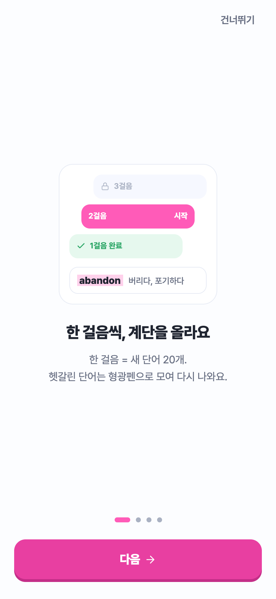<br/><sub><b>온보딩 ①</b><br/>제품 목업으로 계단·형광펜 소개</sub></td>
    <td align="center">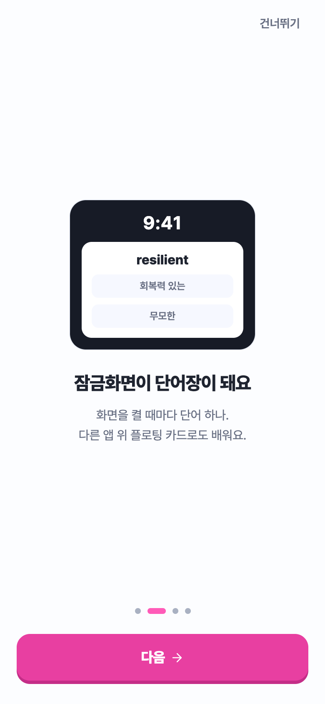<br/><sub><b>온보딩 ②</b><br/>잠금화면 학습 · 그 자리에서 켜기</sub></td>
    <td align="center">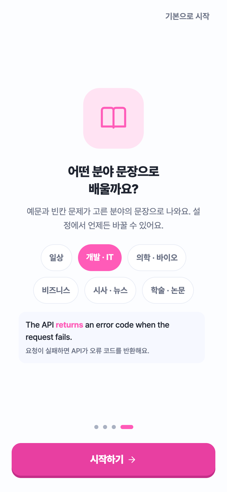<br/><sub><b>온보딩 ④</b><br/>분야 선택 → 실예문 프리뷰</sub></td>
  </tr>
  <tr>
    <td align="center">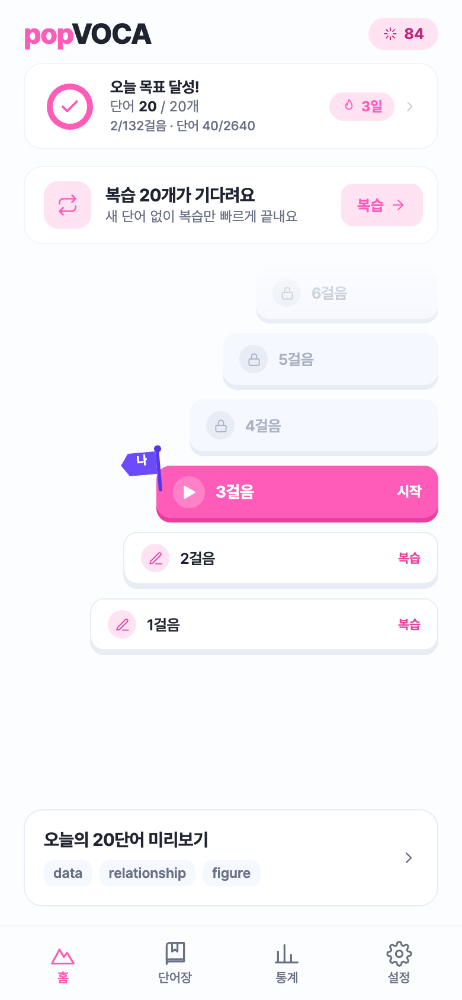<br/><sub><b>홈</b><br/>여정 맥락 · StartHero · 배너 병합</sub></td>
    <td align="center">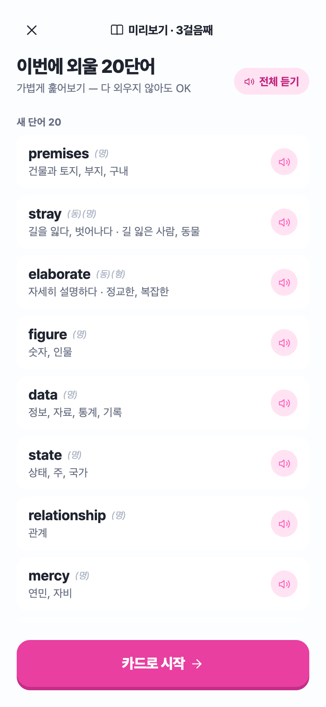<br/><sub><b>레슨 미리보기</b><br/>새 단어/복습 그룹 · 전체 듣기</sub></td>
    <td align="center">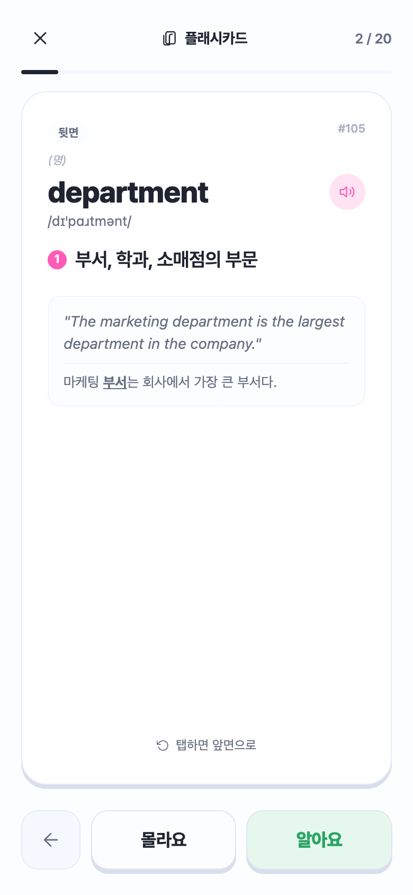<br/><sub><b>플래시카드</b><br/>뜻·예문 · 편향 없는 알아요/몰라요</sub></td>
  </tr>
  <tr>
    <td align="center">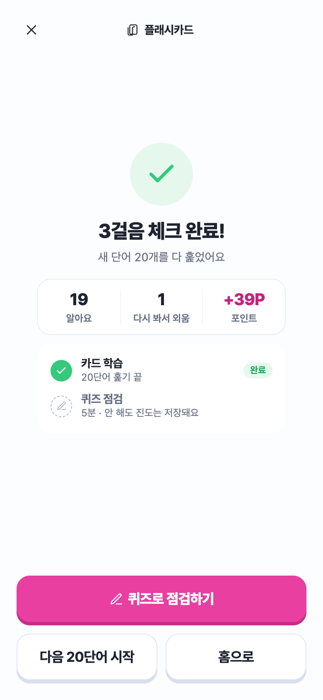<br/><sub><b>걸음 완료</b><br/>완료 연출 + 성과 카드</sub></td>
    <td align="center">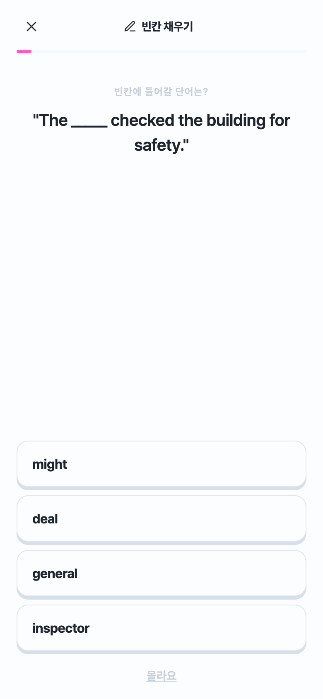<br/><sub><b>퀴즈 점검</b><br/>6유형 · 난이도 계단 배정</sub></td>
    <td align="center">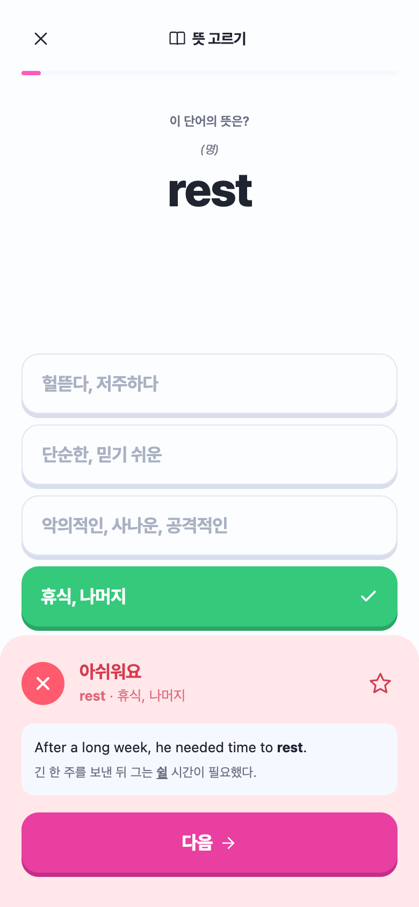<br/><sub><b>퀴즈 피드백</b><br/>예문·오답 해설 · ★저장</sub></td>
  </tr>
  <tr>
    <td align="center">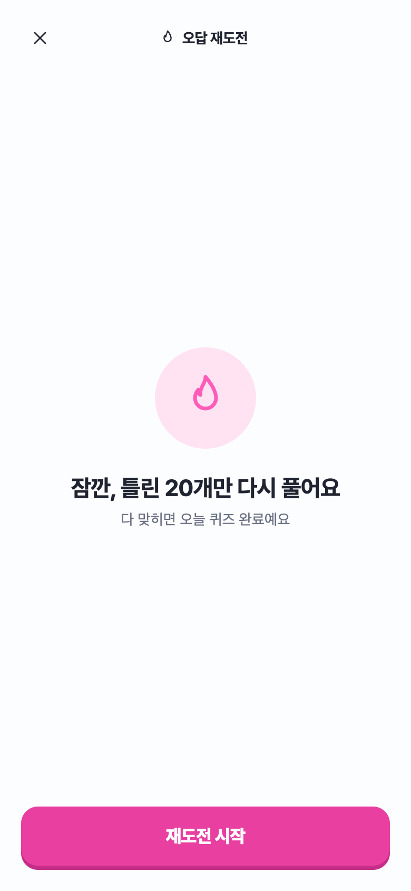<br/><sub><b>오답 재도전</b><br/>예고 화면 → 틀린 것만 다시</sub></td>
    <td align="center">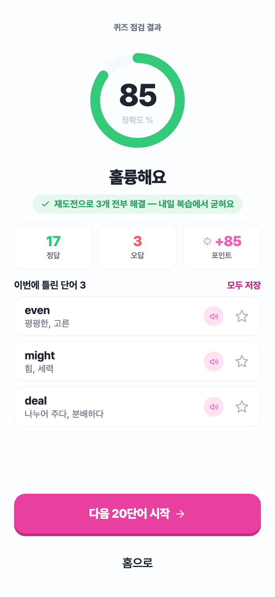<br/><sub><b>퀴즈 결과</b><br/>오답 리스트 · 정확한 포인트</sub></td>
    <td align="center">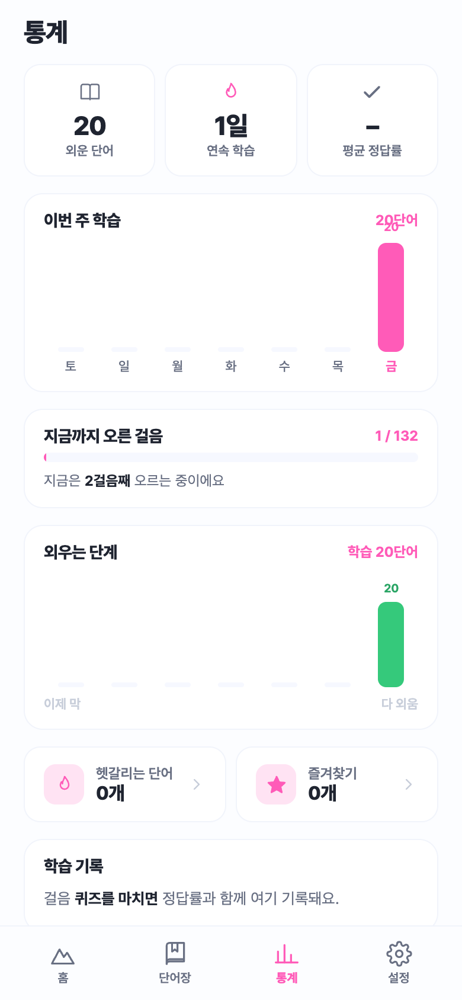<br/><sub><b>통계</b><br/>성취 우선 재배열 · 최근 정답률</sub></td>
  </tr>
  <tr>
    <td align="center">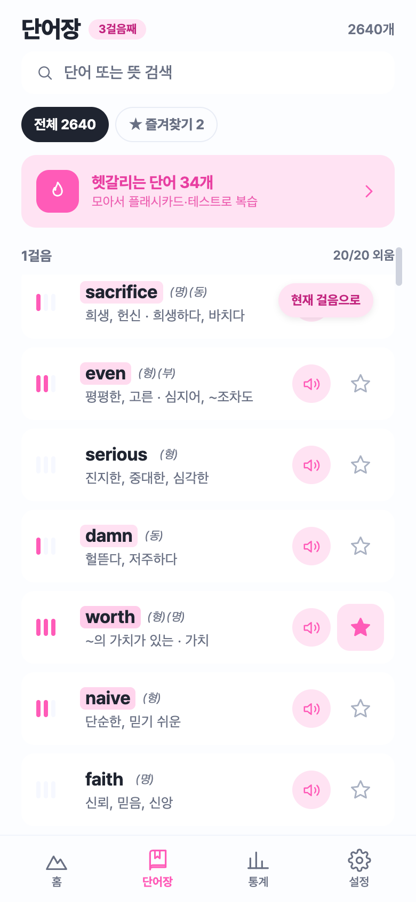<br/><sub><b>단어장</b><br/>걸음 섹션 · 형광펜 강도 게이지</sub></td>
    <td align="center">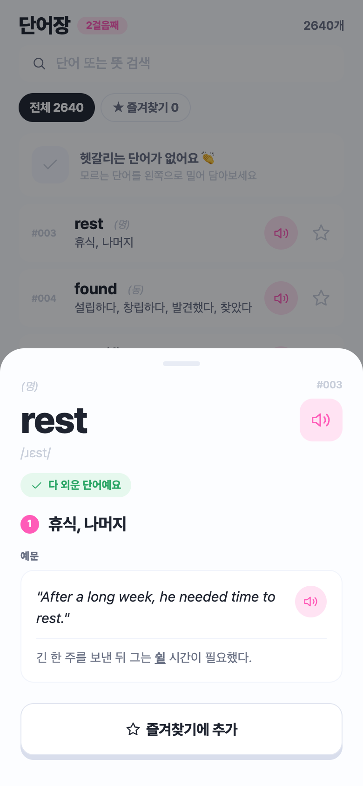<br/><sub><b>단어 상세</b><br/>뜻·예문 · 헷갈려요/즐겨찾기</sub></td>
    <td align="center">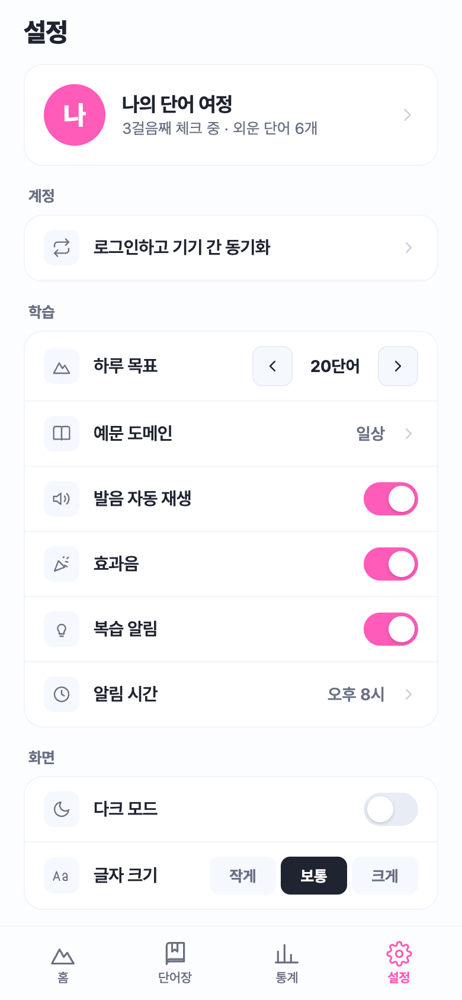<br/><sub><b>설정</b><br/>선택 시트 · 위험작업 격리</sub></td>
  </tr>
  <tr>
    <td align="center">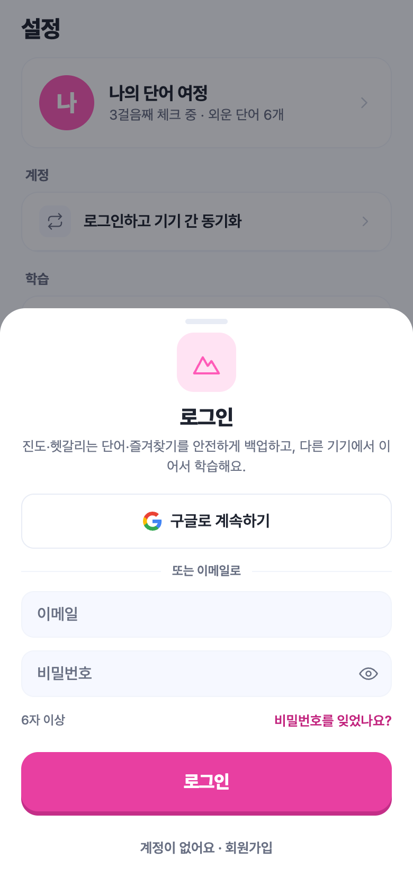<br/><sub><b>로그인</b><br/>신뢰 체인 · 비밀번호 찾기·약관</sub></td>
    <td align="center">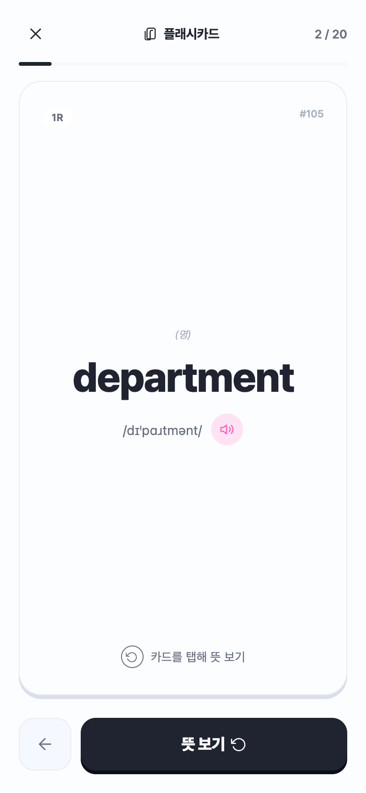<br/><sub><b>플래시카드 (앞)</b><br/>단어 · 발음 · TTS</sub></td>
    <td align="center">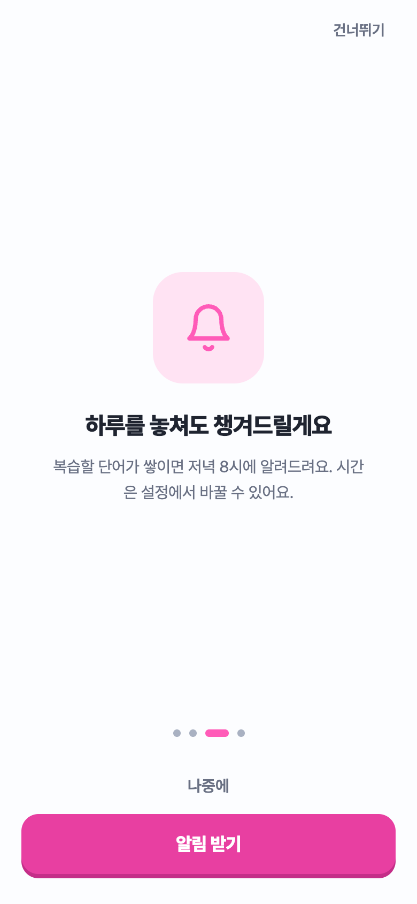<br/><sub><b>온보딩 ③</b><br/>알림 권한을 약속과 같은 화면에서</sub></td>
  </tr>
</table>

<sub>웹 미리보기 화면 캡처 (v3) — 안드로이드 빌드 시 오버레이 · 잠금화면 기능이 추가됩니다</sub>

</div>

## ✨ 주요 기능

- **계단형 진도** — 20단어 = 1걸음, 총 132걸음. 신규 사용자는 1걸음만 열린 상태로 시작.
- **박스형 SRS** — 세션 기반 간격 반복. 복습 단어가 새 카드에 자동으로 섞여 재출현.
- **6가지 퀴즈 유형** — 4지선다(뜻/단어/빈칸) + 글자 타일 조합 + 듣고 맞히기 + 스펠링(힌트).
- **🪟 플로팅 오버레이** — 다른 앱 위에 미니 카드를 띄워 학습 (좌우 스와이프 = 답, 위로 = 이전). *안드로이드 전용*
- **🔒 잠금화면 학습** — 폰을 켤 때마다 단어 카드로 복습. *안드로이드 전용*
- **체크 트랙 vs 정복 트랙** — 플래시카드를 끝내면 걸음이 "체크"(다음 걸음 해금), 퀴즈까지 통과하면 "정복".
- **복습 알림** · **세션 저장/이어하기** · **하드웨어 뒤로가기 처리**
- **오프라인 우선 + 클라우드 동기화** — AsyncStorage 로컬 저장 + Supabase 계정 동기화(RLS 보호).
- **라이트/다크 모드** — 디자인 토큰 게터로 자동 전환.

## 🛠 기술 스택

| 영역 | 사용 기술 |
|------|-----------|
| 프레임워크 | Expo SDK 51, React Native 0.74.5, React 18 |
| 언어 | JavaScript, TypeScript(모듈 브리지), Kotlin(안드 네이티브), Swift(iOS 스텁) |
| 상태 관리 | 단일 `useReducer` (React Navigation 미사용, `screen` 문자열로 화면 전환) |
| 백엔드 | Supabase (Auth + Postgres, Row Level Security) |
| 저장소 | AsyncStorage (로컬) + Supabase (클라우드) |
| UI | react-native-svg, Pretendard 폰트, expo-av / expo-haptics(효과음·햅틱), expo-speech(TTS) |
| 네이티브 | 커스텀 Expo 로컬 모듈 `vocapop-overlay` (SYSTEM_ALERT_WINDOW 오버레이) |

## 📂 저장소 구조

```
popVOCA/
├── vocapop-app/            # 📱 실제 Expo / React Native 앱
│   ├── App.js              #   루트 — 단일 리듀서로 전체 상태·화면 전환 관리
│   ├── data.js             #   학습 로직의 단일 진실 원천 (SRS 박스·세션·퀴즈 회전)
│   ├── theme.js            #   🎨 디자인 토큰 (색 팔레트 라이트/다크, 폰트, 자간)
│   ├── ui.js, Icon.js      #   공용 컴포넌트 · SVG 아이콘
│   ├── Home / Flashcard /  #   화면 컴포넌트
│   │   Quiz / Wordbook /
│   │   Stats / Settings ...
│   ├── modules/            #   🔧 vocapop-overlay — Kotlin 네이티브 오버레이/잠금 모듈
│   ├── supabase.js, sync.js#   백엔드 연동 (anon 키는 클라이언트 공개용, RLS로 보호)
│   └── assets/             #   vocab_merged.json(2,640단어) · quiz_bank.json(손검수) · 폰트 · 효과음
│
└── design-reference/       # 🖼 확정 디자인 프로토타입 (HTML + JSX)
                            #   RN 화면이 픽셀 단위로 이식한 "정답지"
                            #   VocaPoP Prototype.html 을 브라우저로 열면 실제 동작
```

> 📖 각 폴더에 더 자세한 문서가 있습니다: [`vocapop-app/README.md`](vocapop-app/README.md)(빌드·실행), [`vocapop-app/CLAUDE.md`](vocapop-app/CLAUDE.md)(아키텍처), [`design-reference/README.md`](design-reference/README.md)(디자인 이식 가이드).

## 🚀 시작하기

> ⚠️ 커스텀 네이티브 모듈(오버레이)을 쓰기 때문에 **Expo Go로는 실행되지 않습니다.** dev 빌드가 필요합니다.

**필요 환경:** Node 18+, JDK 17, Android SDK(platform 34 + build-tools + 에뮬레이터 AVD 또는 USB 디버깅 실기기). iOS까지 빌드하려면 Mac + Xcode.

```bash
# 1) 설치
cd vocapop-app
npm install

# 2) 네이티브 프로젝트 생성 (로컬 모듈 자동 링크)
npx expo prebuild

# 3) 안드로이드 실행 (dev 빌드 + 설치 + Metro)
npx expo run:android
#   → 첫 빌드는 몇 분 소요. 이후 JS 수정은 hot-reload,
#     Kotlin 네이티브 수정 시에만 재빌드 필요.

# (선택) iOS — 오버레이/잠금 버튼은 자동 숨김
npx expo run:ios
```

**웹 미리보기** (UI 확인용, 네이티브 기능 제외):

```bash
npx expo start --web
```

**릴리스 APK 빌드:**

```bash
cd android && ./gradlew :app:assembleRelease
# → android/app/build/outputs/apk/release/app-release.apk (debug keystore 서명, 바로 설치 가능)
```

## 🔐 데이터 & 백엔드

- Supabase 백엔드는 **한 사용자당 한 행**(`vocapop_state`)에 앱 상태 전체를 jsonb blob으로 저장하며, **Row Level Security로 본인 데이터만 접근** 가능합니다. 스키마는 [`vocapop-app/vocapop-supabase-schema.sql`](vocapop-app/vocapop-supabase-schema.sql) 참고.
- 코드에 포함된 Supabase 키는 **anon(publishable) 키**로, 클라이언트 노출을 전제로 설계된 공개용 키입니다 (민감한 `service_role` 키는 저장소에 없습니다).
- 단어·퀴즈 데이터(`vocab_merged.json`, `quiz_bank.json`)는 앱에 번들됩니다. `quiz_bank.json`의 보기는 **손으로 검수**된 것이라 함부로 재생성하지 마세요.

## 📌 현재 상태

동작·배포 완료 (**v18 / versionCode 18**). 박스형 SRS · 6유형 퀴즈 · 잠금화면 학습 · 플로팅 오버레이 · 복습 알림 · 세션 저장·이어하기 · Supabase 클라우드 동기화 구현됨.

**v3(현재 브랜치)** — 위 [v3에서 달라진 점](#-v3에서-달라진-점)의 디자인·접근성·플로우 개선을 반영. 웹 프리뷰 자동화로 전 플로우 실주행 검증 완료, 네이티브 기능(오버레이·잠금·공유 수집)은 실기기 빌드 검증 대기.

---

<div align="center">
<sub>Designed and Developed by <a href="https://github.com/junehojo">junehojo</a></sub>
</div>
