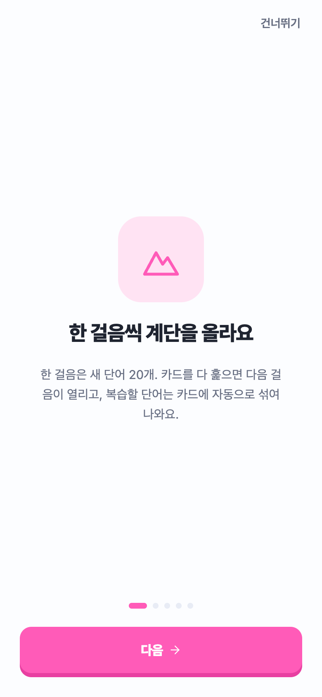
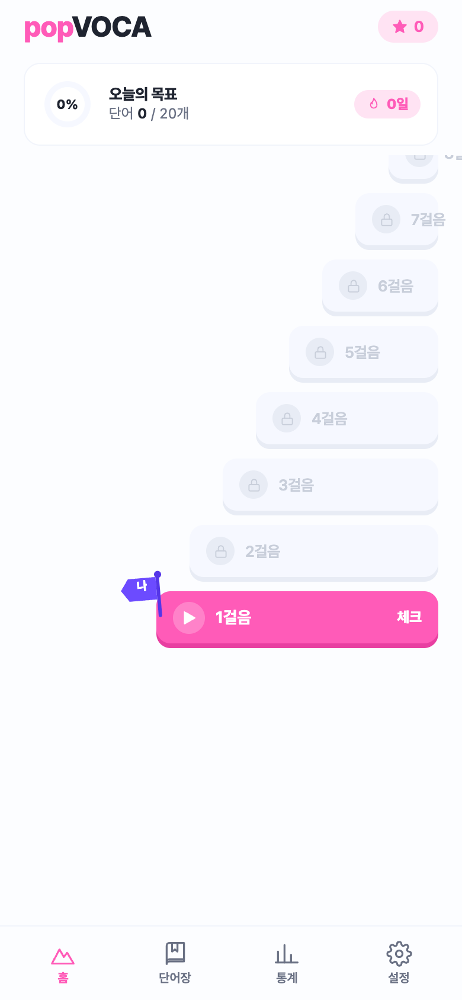
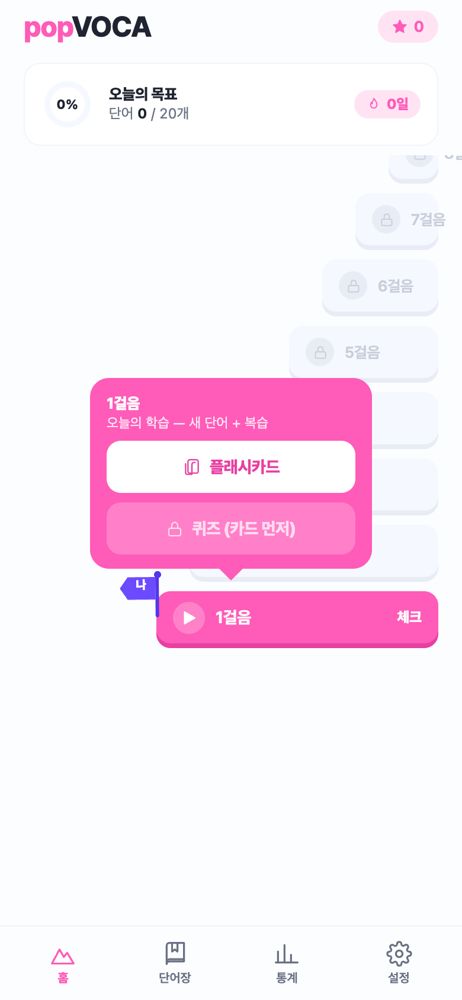
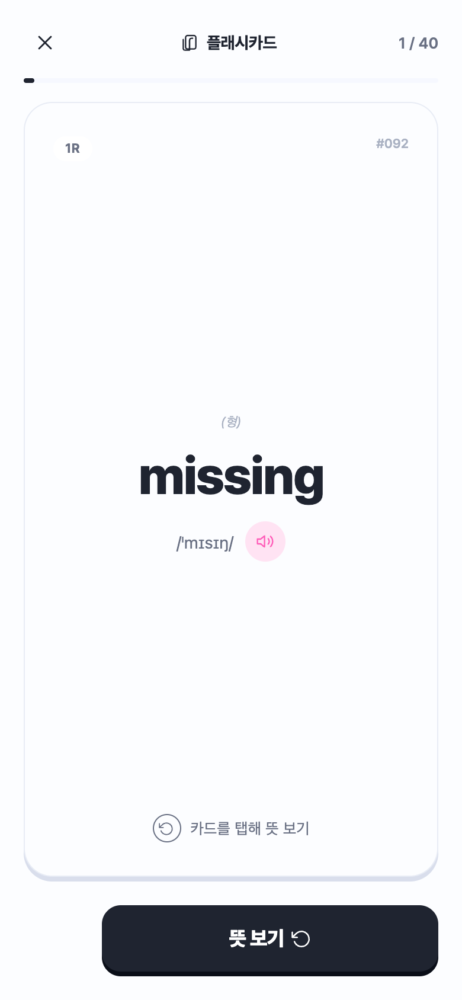
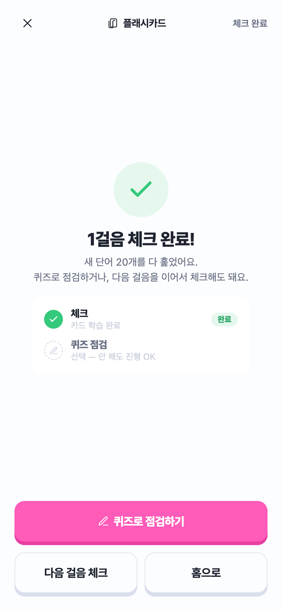

<div align="center">

# 🌸 popVOCA

**토플 단어 학습 앱 — 계단을 오르듯 하루 20단어씩**

박스형 SRS · 6가지 퀴즈 · **안드로이드 잠금화면 학습 & 플로팅 오버레이** · 클라우드 동기화


</div>

---

## 소개

**popVOCA** (`com.vocapop.app`)는 토플 필수 단어 **2,640개**를 계단 오르기 은유로 학습하는 모바일 앱입니다. 20단어가 한 "걸음"이 되고, 카드를 다 훑으면 다음 걸음이 열립니다. 복습해야 할 단어는 박스형 SRS로 카드에 자동으로 섞여 나옵니다.

핵심은 **안드로이드 네이티브 학습 경험**입니다 — 다른 앱 위에 단어 카드를 띄우는 **플로팅 오버레이**와 **잠금화면 학습**은 Kotlin 네이티브 모듈로 구현됐습니다. (iOS는 빌드는 되지만 Apple 정책상 이 기능은 자동으로 숨겨집니다.)

브랜드 컬러는 로고의 "pop"에서 온 핑크 `#FF5BB8`입니다.

## 📱 스크린샷

<div align="center">

<table>
  <tr>
    <td align="center"><br/><sub><b>온보딩</b><br/>계단 오르기 학습 소개</sub></td>
    <td align="center"><br/><sub><b>홈 · 계단 진도</b><br/>걸음마다 20단어씩 해금</sub></td>
    <td align="center"><br/><sub><b>레슨 선택</b><br/>플래시카드 · 퀴즈 진입</sub></td>
  </tr>
  <tr>
    <td align="center"><br/><sub><b>플래시카드 (앞)</b><br/>단어 · 발음 · TTS</sub></td>
    <td align="center"><br/><sub><b>플래시카드 (뒤)</b><br/>뜻 · 예문 · 알아요/몰라요</sub></td>
    <td align="center"><br/><sub><b>걸음 완료</b><br/>체크 트랙 → 퀴즈로 정복</sub></td>
  </tr>
  <tr>
    <td align="center"><br/><sub><b>퀴즈 점검</b><br/>6유형 (빈칸/뜻/타일…)</sub></td>
    <td align="center"><br/><sub><b>단어장</b><br/>2,640단어 · 검색 · 즐겨찾기</sub></td>
    <td align="center"><br/><sub><b>단어 상세</b><br/>뜻 · 예문 · 학습 상태</sub></td>
  </tr>
  <tr>
    <td align="center"><br/><sub><b>통계</b><br/>주간 학습 · 걸음 진척 · 정답률</sub></td>
    <td align="center"><br/><sub><b>설정</b><br/>목표 · 알림 · 다크 모드 · 동기화</sub></td>
    <td align="center"><sub>웹 미리보기 화면 캡처<br/>(안드로이드 빌드 시<br/>오버레이 · 잠금화면 기능 추가)</sub></td>
  </tr>
</table>

</div>

## ✨ 주요 기능

- **계단형 진도** — 20단어 = 1걸음, 총 132걸음. 신규 사용자는 1걸음만 열린 상태로 시작.
- **박스형 SRS** — 세션 기반 간격 반복. 복습 단어가 새 카드에 자동으로 섞여 재출현.
- **6가지 퀴즈 유형** — 4지선다(뜻/단어/빈칸) + 글자 타일 조합 + 듣고 맞히기 + 스펠링(힌트).
- **🪟 플로팅 오버레이** — 다른 앱 위에 미니 카드를 띄워 학습 (좌우 스와이프 = 답, 위로 = 이전). *안드로이드 전용*
- **🔒 잠금화면 학습** — 폰을 켤 때마다 단어 카드로 복습. *안드로이드 전용*
- **체크 트랙 vs 정복 트랙** — 플래시카드를 끝내면 걸음이 "체크"(다음 걸음 해금), 퀴즈까지 통과하면 "정복".
- **복습 알림** · **세션 저장/이어하기** · **하드웨어 뒤로가기 처리**
- **오프라인 우선 + 클라우드 동기화** — AsyncStorage 로컬 저장 + Supabase 계정 동기화(RLS 보호).
- **라이트/다크 모드** — 디자인 토큰 게터로 자동 전환.

## 🛠 기술 스택

| 영역 | 사용 기술 |
|------|-----------|
| 프레임워크 | Expo SDK 51, React Native 0.74.5, React 18 |
| 언어 | JavaScript, TypeScript(모듈 브리지), Kotlin(안드 네이티브), Swift(iOS 스텁) |
| 상태 관리 | 단일 `useReducer` (React Navigation 미사용, `screen` 문자열로 화면 전환) |
| 백엔드 | Supabase (Auth + Postgres, Row Level Security) |
| 저장소 | AsyncStorage (로컬) + Supabase (클라우드) |
| UI | react-native-svg, Pretendard 폰트, expo-av / expo-haptics(효과음·햅틱), expo-speech(TTS) |
| 네이티브 | 커스텀 Expo 로컬 모듈 `vocapop-overlay` (SYSTEM_ALERT_WINDOW 오버레이) |

## 📂 저장소 구조

```
popVOCA/
├── vocapop-app/            # 📱 실제 Expo / React Native 앱
│   ├── App.js              #   루트 — 단일 리듀서로 전체 상태·화면 전환 관리
│   ├── data.js             #   학습 로직의 단일 진실 원천 (SRS 박스·세션·퀴즈 회전)
│   ├── theme.js            #   🎨 디자인 토큰 (색 팔레트 라이트/다크, 폰트, 자간)
│   ├── ui.js, Icon.js      #   공용 컴포넌트 · SVG 아이콘
│   ├── Home / Flashcard /  #   화면 컴포넌트
│   │   Quiz / Wordbook /
│   │   Stats / Settings ...
│   ├── modules/            #   🔧 vocapop-overlay — Kotlin 네이티브 오버레이/잠금 모듈
│   ├── supabase.js, sync.js#   백엔드 연동 (anon 키는 클라이언트 공개용, RLS로 보호)
│   └── assets/             #   vocab_merged.json(2,640단어) · quiz_bank.json(손검수) · 폰트 · 효과음
│
└── design-reference/       # 🖼 확정 디자인 프로토타입 (HTML + JSX)
                            #   RN 화면이 픽셀 단위로 이식한 "정답지"
                            #   VocaPoP Prototype.html 을 브라우저로 열면 실제 동작
```

> 📖 각 폴더에 더 자세한 문서가 있습니다: [`vocapop-app/README.md`](vocapop-app/README.md)(빌드·실행), [`vocapop-app/CLAUDE.md`](vocapop-app/CLAUDE.md)(아키텍처), [`design-reference/README.md`](design-reference/README.md)(디자인 이식 가이드).

## 🚀 시작하기

> ⚠️ 커스텀 네이티브 모듈(오버레이)을 쓰기 때문에 **Expo Go로는 실행되지 않습니다.** dev 빌드가 필요합니다.

**필요 환경:** Node 18+, JDK 17, Android SDK(platform 34 + build-tools + 에뮬레이터 AVD 또는 USB 디버깅 실기기). iOS까지 빌드하려면 Mac + Xcode.

```bash
# 1) 설치
cd vocapop-app
npm install

# 2) 네이티브 프로젝트 생성 (로컬 모듈 자동 링크)
npx expo prebuild

# 3) 안드로이드 실행 (dev 빌드 + 설치 + Metro)
npx expo run:android
#   → 첫 빌드는 몇 분 소요. 이후 JS 수정은 hot-reload,
#     Kotlin 네이티브 수정 시에만 재빌드 필요.

# (선택) iOS — 오버레이/잠금 버튼은 자동 숨김
npx expo run:ios
```

**웹 미리보기** (UI 확인용, 네이티브 기능 제외):

```bash
npx expo start --web
```

**릴리스 APK 빌드:**

```bash
cd android && ./gradlew :app:assembleRelease
# → android/app/build/outputs/apk/release/app-release.apk (debug keystore 서명, 바로 설치 가능)
```

## 🔐 데이터 & 백엔드

- Supabase 백엔드는 **한 사용자당 한 행**(`vocapop_state`)에 앱 상태 전체를 jsonb blob으로 저장하며, **Row Level Security로 본인 데이터만 접근** 가능합니다. 스키마는 [`vocapop-app/vocapop-supabase-schema.sql`](vocapop-app/vocapop-supabase-schema.sql) 참고.
- 코드에 포함된 Supabase 키는 **anon(publishable) 키**로, 클라이언트 노출을 전제로 설계된 공개용 키입니다 (민감한 `service_role` 키는 저장소에 없습니다).
- 단어·퀴즈 데이터(`vocab_merged.json`, `quiz_bank.json`)는 앱에 번들됩니다. `quiz_bank.json`의 보기는 **손으로 검수**된 것이라 함부로 재생성하지 마세요.

## 📌 현재 상태

동작·배포 완료 (**v18 / versionCode 18**). 박스형 SRS · 6유형 퀴즈 · 잠금화면 학습 · 플로팅 오버레이 · 복습 알림 · 세션 저장·이어하기 · Supabase 클라우드 동기화 구현됨.

---

<div align="center">
<sub>Designed and Developed by <a href="https://github.com/junehojo">junehojo</a></sub>
</div>
